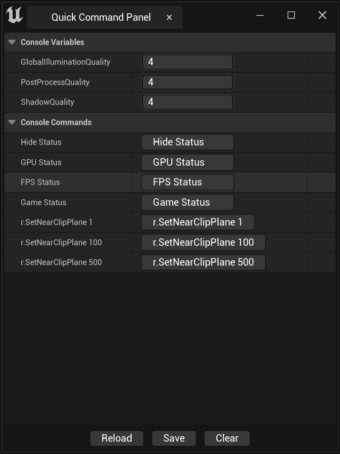
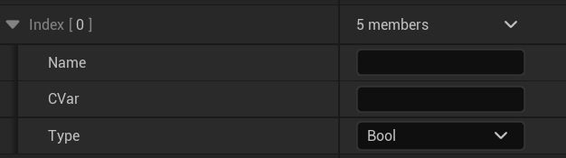
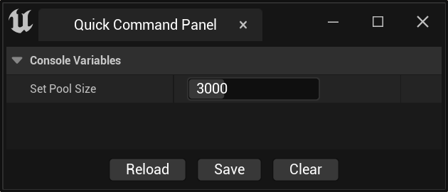

#  Quick Command Panel 

`Quick Command Panel` is a plugin that allows you to quickly set console commands, including two modules:

`QuickCommandCore` —— **Runtime Module**
`QuickCommand`  —— **Editor Module**

------

## Getting Started

Please ensure that the plug-in is turned on and loaded, and can be confirmed in the `Edit` ->`Plugins` panel.

### Step 1

Configure the `Command Panel` from the Settings panel and open the `Edit` ->`Project Settings` panel.

Find `Quick Command` in the Plugins category and configure the `Quick Command Panel`.

###  Step 2

As you can see, there are two categories.`Console Variables`and`Console Commands`，Please consult the official documentation for the differences between them. I can tell you that `r.Streaming. PoolSize` is a `Console Variable`, and the `stat xxxx` is a` Console Command `.

With these two buttons, we can add `Console Variables` and`Console Commands`.

####  Add`Console Variables`

As you can see, the interface looks like this. `Name `is the display name of the variable, and the value of `CVar` is the actual console variable, such as`r.Streaming. PoolSize`. `Type`: Select the corresponding console variable type. There are four types: `Bool`, `Integer`,  `Float`, and `String`.

In this example, we choose `Integer`. When selecting `Integer` or `Float`, the interface will display two settings, `Min` and `Max`, which allows us to set the minimum and maximum values for adjustment.

In this example, we set `Min` to 0 and `Max` to 10000.

After completing the settings, reopen the `Quick Command Panel` or click the `Reload` button to see the following interface.

####  Add`Console Commands`

Adding commands is much simpler than adding `Console Variables`.

Click to add a `Console Commands`, and we can see the operation interface as follows:

`Name`is display name，`Command` is the actual console command，such as`stat fps`、`stat game`and`stat none`etc.

###  Step 3

After adding commands, we can reopen the `Quick Command Panel` or click the `Reload` button to obtain a customized command adjustment panel.

## Note
At the bottom of the `Quick Command Panel`, there are three buttons: `Reload`, `Save`, and `Clear`.

- Button`Reload` —— After changing the configuration, you can refresh the UI of the 'Quick Command Panel'
- Button`Save` —— Save the `Console Variables` to the `DefaultGame.ini` file, and the value will be applied next time the plugin is started
- Button`Clear` —— Empty the `Console Variables` saved in the `DefaultGame.ini `file

Attention： Currently, only `Console Variables` are supported for saving, and this function supports running after packaging.
