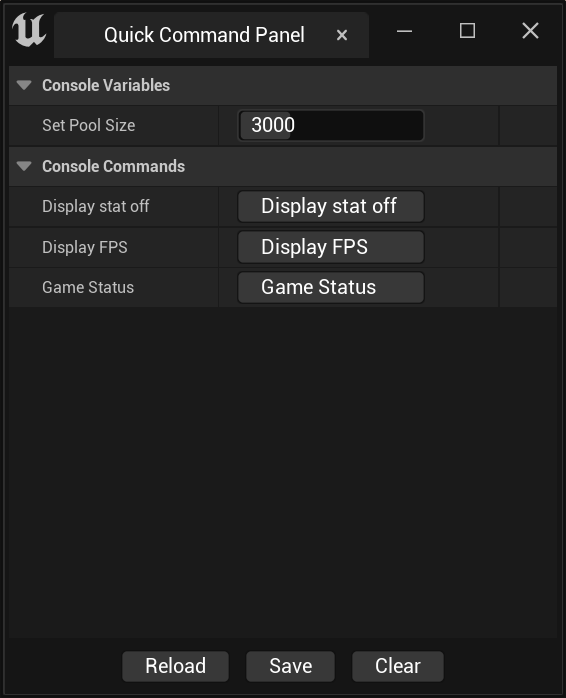

#  Quick Command Panel 

`Quick Command Panel`是一个能让你快速设置控制台命令的插件，包含了两个模块：

`QuickCommandCore` —— **Runtime Module**
`QuickCommand`  —— **Editor Module**

------

## Getting Started

请确保插件已经开启并加载，可以在`Edit`->`Plugins`面板中确认。

### Step 1

从设置面板中配置`Command Panel`，打开`Edit`->`Project Settings`面板。

在Plugins分类中找到`Quick Command`，对`Quick Command Panel`进行配置。

###  Step 2

可以看到，这里有两个分类。`Console Variables`和`Console Commands`，它们之间的区别请查阅官方文档。可以告诉大家的是，`r.Streaming.PoolSize`是`Console Variable`，而`stat系列命令`是`Console Command`。

通过这两个按钮，我们可以添加`Console Variables`和`Console Commands`。

####  添加`Console Variables`

可以看到，界面是这样的。`Name`是该条变量的显示名称，`CVar`的值为实际的控制台变量，例如`r.Streaming.PoolSize`。Type则选择对应的控制台变量类型，一共有4种：`Bool`、`Integer`、`Float`和`String`。

在这个例子中，我们选择`Integer`。选择`Integer`或`Float`时，界面会出现`Min`和`Max`两个设置，这使得我们可以设定调整的最小值和最大值。

在这个例子中，我们设置`Min`为0，`Max`为10000。

完成设置后，重新打开`Quick Command Panel`或者点击`Reload`按钮，即可看到以下界面。

####  添加`Console Commands`

相比添加`Console Variables`，添加命令则简单许多。

点击新增一个`Console Commands`，我们可以看到操作界面如下：

`Name`是显示名称，`Command`则填入实际的控制台命令，例如`stat fps`、`stat game`和`stat none`等。

###  Step 3

完成命令的添加后，我们重新打开`Quick Command Panel`或者点击`Reload`按钮，就可以得到一个自定义的命令调整面板。

## 其他事项
`Quick Command Panel`的底部，有3个按钮，它们分别是`Reload`、`Save`和`Clear`。

- 按钮`Reload` —— 更改配置后，可以刷新`Quick Command Panel`的UI
- 按钮`Save` —— 保存`Console Variables`到`DefaultGame.ini`文件中，下次启动插件会应用该值
- 按钮`Clear` —— 清空保存到`DefaultGame.ini`文件中的`Console Variables`

Note：只支持保存`Console Variables`，而且该功能支持项目打包后运行。
